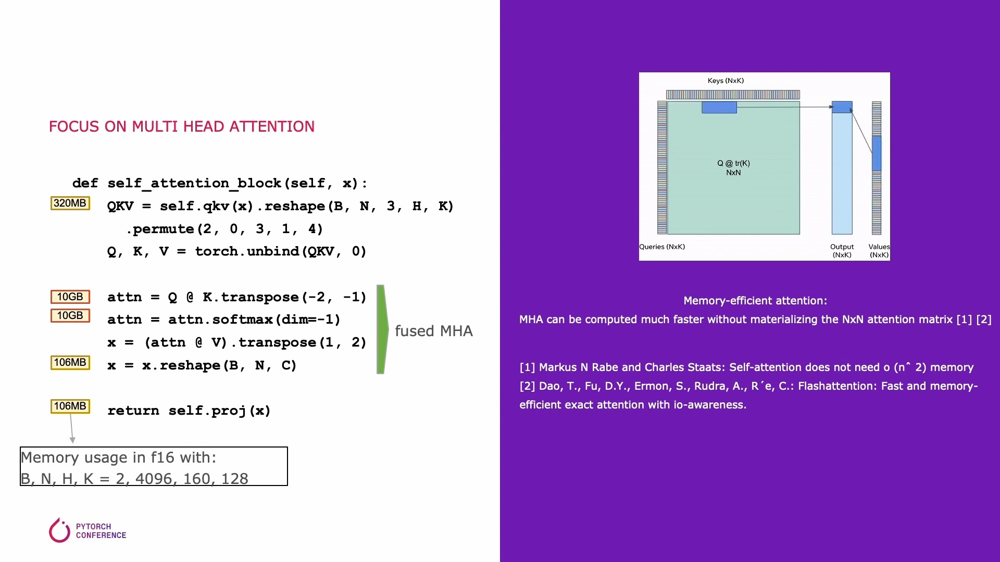
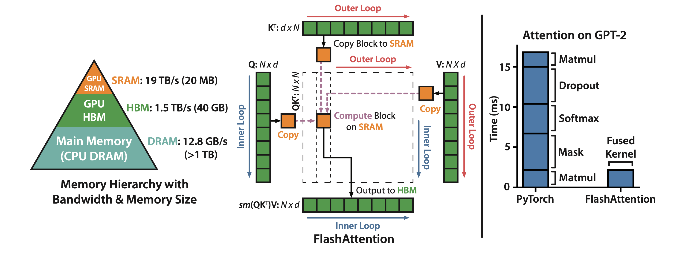

# Motivation

Recently, bunch of awesome optimization techniques or kernels for training Large Language Model (LLM) exists but few of them are implemented in [transformers](https://github.com/huggingface/transformers).

- [x] Reduced Precision Training (FP16 (mixed precision) or FP32)
- [x] Efficient Scaled Dot Product Attention (SDPA)
- [x] Fully Sharded Data Parallel (FSDP) or Zero Redundancy Optimizer (ZeRO)
- [x] activation checkpointing (on GPU / in every layer)
    - [ ] CPU offloading
    - [ ] selective checkpointing
- [ ] Memory Efficient Cross Entropy (CE) loss kernel
- [ ] Fused RoPE, LayerNorm, MLP and so on

This project provides monkey patched llama class for the appetizer of LLMs with larger vocab and long context inputs. 
(i dont cover Parameter Efficient Fine-Tuning (PEFT) methods such as QLoRA or 4-bit quantized training)


## 1. Efficient SDPA

Efficient attention reduce both space and time complexity by fusing kernels and implementing cumulative attention (online softmax).
Thanks to the memory efficient attenntions, self attention block does not requires O(n^2) anymore but LLM still need bunch of memories for full fine-tuning.




[Flash attention](https://github.com/Dao-AILab/flash-attention) improve this mechanism even further leveraging A100 GPU's memory hierarchy.




## 2. FSDP or ZeRO

FSDP or ZeRO is designe to remove the redundancy for distributed training by partitioning optimizer, gradients and parameters into each devices.
Especially ZeRO-3 achieve significant memory reduction but it scarifies training wall clock time because of comunication (1.5 times slower).
But from a memory perspective, it's still not enough for long context and larger vocabulary. 


You can reduce memory extremely by offloading partitioned parameters, optimizer states and gradients to CPU 


## 3. Activation Checkpointing

Activation checkpointing (also known as gradient checkpointing) also can reduce memory significantly by sacrificing training wall clock time.
it save Neural Network (NN) layer's activations selectively in forward path, and re-compute intermediate activations for back-propagation.
(Basically, activation memory of transformer-based models is proportional to the number of `hidden_dim * batch * seq_len * n_layers` (For GPT-2 like model, it consumes `12 * hidden_dim * batch * seq_len * n_layers`))


(animation credit: [cybertronai/gradient-checkpointing](https://github.com/Dao-AILab/flash-attention))


## 4. Offloading Activation checkpointing

Activation checkpointing can be optimized more by offloading activations to CPU and less frequently (selective checkpointing).
But memory copy between CPU and GPU can dominate training wall clock time when input tensor size is small. 


## 5. Memory Efficient Cross Entropy (CE) loss kernel

Recent LLMs like Gemma or LLaMa3 have large vocab size where it dominate peak GPU memory (see [this issue](https://github.com/pytorch/pytorch/issues/124480)). 
It follows below procedure to compute loss.

- (we want to train LLaMa3 with two 32K length sequence using bf16.)
- convert last hidden tensor to logits (`[B, T, vocab_size] = [2, 32678, 128256] * 2 bytes = 15.61GB`)
- upcast to float32 for accurate loss computation (`B*T, vocab_size = [65356, 128256] * 4 bytes = 31.23GB`)
- loss computation (need empty tensor to get log_softmax and gradients) (`B*T, vocab_size = [65356, 128256] * 4 bytes = 31.23GB`)

## 6. Fused RoPE, LayerNorm, MLP and so on

Using `Fused Kernel` means implement multiple operations in once at GPU’s SRAM.
It usually saves times by reducing the number of data movements (from DRAM to SRAM and SRAM to DRAM) and so on.
Check [Triton](https://triton-lang.org/main/getting-started/tutorials/02-fused-softmax.html#sphx-glr-getting-started-tutorials-02-fused-softmax-py) for more details.


In this project, kernels are adapted from unsloth and torchtitan


# Profiling

## Installation


```
# create new venv
VENV_DIR=/path/to/venv
VENV_NAME=tmp
python -m pip install --upgrade pip
pip install virtualenv
python -m virtualenv -p python3 $VENV_DIR/$VENV_NAME
```

```
VENV_DIR=/path/to/venv
VENV_NAME=tmp
source $VENV_DIR/$VENV_NAME/bin/activate
cd /path/to/dir && pip install -r requirements 
```

## Sanity Check

```bash
# pip install -r requirements.txt
python test_fused_ce_loss.py
```

<details>

```python
loss         : 4.976020336151123
loss_        : 4.96875
torch.allclose(loss.float(), loss_.float(), rtol=rtol, atol=atol): True

weight_grad  : tensor([[[-2.0504e-04, -2.7120e-06, -9.2030e-05,  ..., -6.4850e-05,
          -1.7548e-04,  4.3869e-05],
         [-1.0538e-04, -5.5313e-05,  4.8637e-05,  ...,  1.9073e-04,
          -1.6880e-04, -2.6703e-05],
         [ 1.5163e-04, -2.0599e-04, -1.7643e-04,  ...,  1.5140e-05,
           5.6744e-05,  8.2493e-05],
         ...,
         [ 0.0000e+00,  0.0000e+00,  0.0000e+00,  ...,  0.0000e+00,
           0.0000e+00,  0.0000e+00],
         [ 0.0000e+00,  0.0000e+00,  0.0000e+00,  ...,  0.0000e+00,
           0.0000e+00,  0.0000e+00],
         [ 0.0000e+00,  0.0000e+00,  0.0000e+00,  ...,  0.0000e+00,
           0.0000e+00,  0.0000e+00]],

        [[-2.0313e-04,  1.6975e-04,  3.7432e-05,  ...,  1.5545e-04,
           1.4019e-04, -5.0545e-05],
         [-8.2970e-05,  1.3447e-04,  1.7047e-05,  ..., -1.8883e-04,
           1.1635e-04, -8.4877e-05],
         [ 2.0981e-05,  8.5831e-05, -6.4850e-05,  ...,  5.0306e-05,
          -1.2577e-05,  8.6784e-05],
         ...,
         [ 0.0000e+00,  0.0000e+00,  0.0000e+00,  ...,  0.0000e+00,
           0.0000e+00,  0.0000e+00],
         [ 0.0000e+00,  0.0000e+00,  0.0000e+00,  ...,  0.0000e+00,
           0.0000e+00,  0.0000e+00],
         [ 0.0000e+00,  0.0000e+00,  0.0000e+00,  ...,  0.0000e+00,
           0.0000e+00,  0.0000e+00]]], device='cuda:0', dtype=torch.bfloat16)
weight_grad_ : tensor([[[-2.0504e-04, -2.7120e-06, -9.2030e-05,  ..., -6.4850e-05,
          -1.7548e-04,  4.3869e-05],
         [-1.0538e-04, -5.5313e-05,  4.8637e-05,  ...,  1.9073e-04,
          -1.6880e-04, -2.6703e-05],
         [ 1.5163e-04, -2.0599e-04, -1.7643e-04,  ...,  1.5140e-05,
           5.6744e-05,  8.2493e-05],
         ...,
         [ 0.0000e+00,  0.0000e+00,  0.0000e+00,  ...,  0.0000e+00,
           0.0000e+00,  0.0000e+00],
         [ 0.0000e+00,  0.0000e+00,  0.0000e+00,  ...,  0.0000e+00,
           0.0000e+00,  0.0000e+00],
         [ 0.0000e+00,  0.0000e+00,  0.0000e+00,  ...,  0.0000e+00,
           0.0000e+00,  0.0000e+00]],

        [[-2.0313e-04,  1.6975e-04,  3.7432e-05,  ...,  1.5545e-04,
           1.4019e-04, -5.0545e-05],
         [-8.2970e-05,  1.3447e-04,  1.7047e-05,  ..., -1.8883e-04,
           1.1635e-04, -8.4877e-05],
         [ 2.0981e-05,  8.5831e-05, -6.4850e-05,  ...,  5.0306e-05,
          -1.2577e-05,  8.6784e-05],
         ...,
         [ 0.0000e+00,  0.0000e+00,  0.0000e+00,  ...,  0.0000e+00,
           0.0000e+00,  0.0000e+00],
         [ 0.0000e+00,  0.0000e+00,  0.0000e+00,  ...,  0.0000e+00,
           0.0000e+00,  0.0000e+00],
         [ 0.0000e+00,  0.0000e+00,  0.0000e+00,  ...,  0.0000e+00,
           0.0000e+00,  0.0000e+00]]], device='cuda:0', dtype=torch.bfloat16)
torch.allclose(input_grad, input_grad_, rtol=rtol, atol=atol): True

weight_grad  : tensor([[ 0.0033, -0.0006, -0.0019,  ..., -0.0022, -0.0033, -0.0028],
        [ 0.0031,  0.0003, -0.0002,  ...,  0.0026,  0.0008, -0.0031],
        [ 0.0026, -0.0013, -0.0021,  ..., -0.0005, -0.0044, -0.0038],
        ...,
        [ 0.0028, -0.0068, -0.0085,  ..., -0.0064, -0.0008, -0.0092],
        [ 0.0021, -0.0011, -0.0028,  ...,  0.0010, -0.0060,  0.0060],
        [ 0.0066, -0.0066, -0.0029,  ...,  0.0062,  0.0068, -0.0077]],
       device='cuda:0', dtype=torch.bfloat16)
weight_grad_ : tensor([[ 0.0033, -0.0006, -0.0019,  ..., -0.0022, -0.0033, -0.0028],
        [ 0.0031,  0.0003, -0.0002,  ...,  0.0026,  0.0008, -0.0031],
        [ 0.0026, -0.0013, -0.0021,  ..., -0.0005, -0.0045, -0.0038],
        ...,
        [ 0.0028, -0.0068, -0.0085,  ..., -0.0064, -0.0009, -0.0092],
        [ 0.0021, -0.0011, -0.0028,  ...,  0.0010, -0.0060,  0.0060],
        [ 0.0066, -0.0066, -0.0029,  ...,  0.0062,  0.0068, -0.0077]],
       device='cuda:0', dtype=torch.bfloat16)
torch.allclose(weight_grad, weight_grad_, rtol=rtol, atol=atol): True
```

</details>

## Profiling with distributed setting

```
WORLD_SIZE=?
MACHINE_GPU_COUNT=?
MASTER_ADDR=?
MASTER_PORT=?
MACHINE_RANK=?
```

```bash
MODEL_PATH="meta-llama/Meta-Llama-3-8B"

# CLASS_TYPE="auto"
CLASS_TYPE="custom_optimized"

DTYPE="bf16"
BATCH_SIZE=1
SEQ_LEN=32768
NUM_CHECKPOINTS=1

DS_CONFIG_PATH="ds_configs/ds_config_zero3_cpu.json"
DISTRIBUTED_ARGS="--num_processes $(($MACHINE_GPU_COUNT*$WORLD_SIZE)) --num_machines $WORLD_SIZE --main_process_ip $MASTER_ADDR --main_process_port $MASTER_PORT --machine_rank $MACHINE_RANK"

accelerate launch $DISTRIBUTED_ARGS \
--use_deepspeed \
--deepspeed_config_file ${DS_CONFIG_PATH} \
--deepspeed_multinode_launcher standard \
./profile_fused_ce_loss.py \
--recording_from_beginning \
--use_torch_profiler \
--model_path $MODEL_PATH \
--class_type $CLASS_TYPE \
--dtype $DTYPE \
--batch_size $BATCH_SIZE \
--seq_len $SEQ_LEN \
--use_deepspeed_activation_checkpointing \
--num_checkpoints 1
```

### Baseline

- 1x 80GB A100
- `[B, T] = [1, 32768]` input size
- bf16
- flash attention (torch SDPA)
- offloading param and gradient to CPU (because i want to scale up with FSDP after profiling)
- activation checkpointing (in every layer and offload to CPU)


### fused CE loss

- 1x 80GB A100
- `[B, T] = [1, 32768]` input size


- 2x 80GB A100
- `[B, T] = [4, 20480]` input size


## Fused CE Comparison (OG vs Malek's vs Liger) with Distributed Setting

- 2x 80GB A100
- max seq_len: 8192
- zero3 with cpu offload
- grad ckpt
- vanilla vs malek vs liger (only fused ce is activated)


```
WORLD_SIZE=?
MACHINE_GPU_COUNT=?
MASTER_ADDR=?
MASTER_PORT=?
MACHINE_RANK=?
```

```bash
MODEL_PATH="meta-llama/Meta-Llama-3-8B"
CLASS_TYPE="custom_optimized"
MAX_INPUT_LENGTH=8192
PER_DEVICE_TRAIN_BATCH_SIZE=1
GRAD_ACCUM=2

# DS_CONFIG_PATH="ds_configs/ds_config_zero3.json"
DS_CONFIG_PATH="ds_configs/ds_config_zero3_cpu.json"
DISTRIBUTED_ARGS="--num_processes $(($MACHINE_GPU_COUNT*$WORLD_SIZE)) --num_machines $WORLD_SIZE --main_process_ip $MASTER_ADDR --main_process_port $MASTER_PORT --machine_rank $MACHINE_RANK"
echo $DISTRIBUTED_ARGS
accelerate launch $DISTRIBUTED_ARGS train.py \
--class_type $CLASS_TYPE \
--model_path $MODEL_PATH \
--max_input_length $MAX_INPUT_LENGTH \
--per_device_train_batch_size $PER_DEVICE_TRAIN_BATCH_SIZE \
--gradient_accumulation_steps $GRAD_ACCUM \
--use_grad_ckpt \
--ds_config $DS_CONFIG_PATH
```

### for Liger

first, intall [Liger](https://github.com/linkedin/Liger-Kernel/tree/main?tab=readme-ov-file#installation) and then set `CLASS_TYPE=liger`

```bash
pip install liger-kernel 
```

```bash
CLASS_TYPE="liger"
echo $DISTRIBUTED_ARGS
accelerate launch $DISTRIBUTED_ARGS train.py \
--class_type $CLASS_TYPE \
--model_path $MODEL_PATH \
--max_input_length $MAX_INPUT_LENGTH \
--per_device_train_batch_size $PER_DEVICE_TRAIN_BATCH_SIZE \
--gradient_accumulation_steps $GRAD_ACCUM \
--use_grad_ckpt \
--ds_config $DS_CONFIG_PATH
```


### using FSDP

- ref
  - [fsdp doc](https://pytorch.org/docs/stable/fsdp.html)
  - [hf training args](https://github.com/huggingface/transformers/blob/bdf36dcd48106a4a0278ed7f3cc26cd65ab7b066/src/transformers/training_args.py#L473-L498)
  - [hf accelerate doc](https://github.com/huggingface/accelerate/blob/main/docs/source/usage_guides/fsdp.md)
  - [liger example](https://github.com/linkedin/Liger-Kernel/tree/main/examples/huggingface)

```
WORLD_SIZE=?
MACHINE_GPU_COUNT=?
MASTER_ADDR=?
MASTER_PORT=?
MACHINE_RANK=?
```

```bash
MODEL_PATH="meta-llama/Meta-Llama-3-8B"
CLASS_TYPE="custom_optimized"
# CLASS_TYPE="liger"
MAX_INPUT_LENGTH=8192
PER_DEVICE_TRAIN_BATCH_SIZE=1
GRAD_ACCUM=2

torchrun --nnodes=$WORLD_SIZE --nproc-per-node=$MACHINE_GPU_COUNT train.py \
--class_type $CLASS_TYPE \
--model_path $MODEL_PATH \
--max_input_length $MAX_INPUT_LENGTH \
--per_device_train_batch_size $PER_DEVICE_TRAIN_BATCH_SIZE \
--gradient_accumulation_steps $GRAD_ACCUM \
--use_grad_ckpt \
--fsdp "full_shard auto_wrap offload" \
--fsdp_config fsdp_configs/fsdp.json
```


# References

- [Reference model class from (huggingface/transformers)](https://github.com/huggingface/transformers/blob/v4.39-release/src/transformers/models/llama/modeling_llama.py)
- [Triton ops and modules from (Dao-AILab/flash-attention)](https://github.com/Dao-AILab/flash-attention/tree/main/flash_attn)
- [Triton kernels from Unsloth AI](https://github.com/unslothai/unsloth/tree/main/unsloth/kernels)
- [Memory-Efficient Cross Entropy Loss from (mgmalek/efficient_cross_entropy)](https://github.com/mgmalek/efficient_cross_entropy)
- [Some modules from (mosaicml/llm-foundry)](https://github.com/mosaicml/llm-foundry/tree/main/llmfoundry/models)
- [Liger-Kernel](https://github.com/linkedin/Liger-Kernel/tree/main)